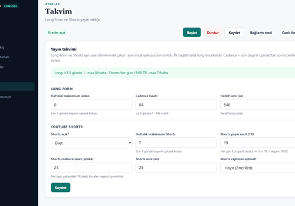
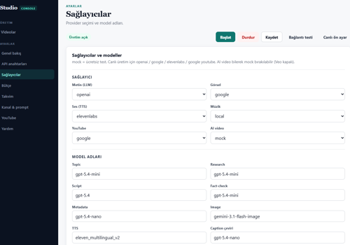
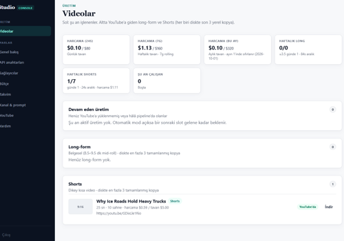
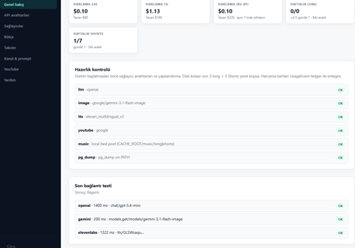
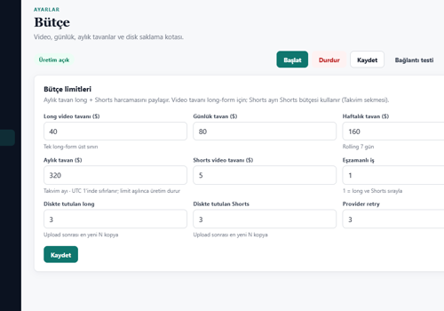
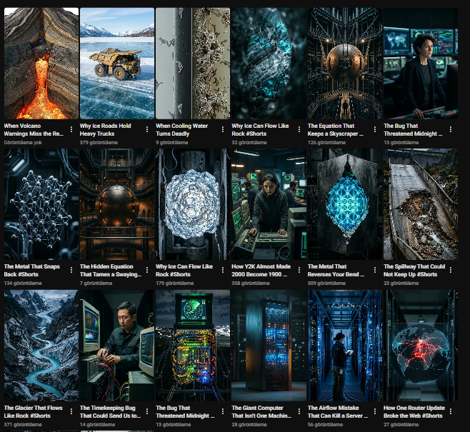

# Production Control Interface

This document presents selected workflow configuration interfaces from the **Autonomous AI Video Production System** developed by [TankDev](https://tankdev.tech).

The production panel provides a centralized interface for configuring the behavior of the automated video production workflow.

> The screenshots below represent the implemented system interface. Credentials, API keys, access tokens, channel secrets, and other security-sensitive values are excluded from public documentation.

## Workflow Configuration

The production workflow is configured through a multi-section control interface.

These screens expose operational settings used to control different parts of the production process while keeping the underlying orchestration and provider implementations separated from the interface layer.

### Configuration View 1

Production workflow configuration interface used to manage system-level production parameters.

### Configuration View 2

Additional workflow configuration controls within the centralized production panel.

### Configuration View 3

Configuration view for parameters used by the automated production workflow.

### Configuration View 4

Operational configuration interface for controlling production behavior.

### Configuration View 5

Additional production settings exposed through the workflow control panel.

## Published Production Outputs

The production workflow has been used to generate and publish multiple short-form and long-form video outputs across different technical and science topics.

This view demonstrates the downstream result of the production pipeline — from topic research and content generation through media assembly and publishing.

The system is designed to automate the production workflow itself. Audience reach, views, engagement, and other platform-performance outcomes are external to the production system and are not presented as system performance metrics.

## Interface Role

The interface acts as the configuration surface for the production system.

Rather than requiring production behavior to be changed directly in source code, configurable workflow parameters can be managed through the control panel.

The interface operates above the underlying production architecture:

<pre>
Production Control Interface
            │
            ▼
Configuration Layer
            │
            ▼
Scheduler / Orchestrator
            │
            ▼
Research & Content Generation
            │
            ▼
Voice & Visual Providers
            │
            ▼
Media Assembly
            │
            ▼
Production Controls
            │
            ▼
Publishing
</pre>

The exact relationship between individual interface fields and proprietary production logic is intentionally not documented publicly.

## Security and Public Documentation

The screenshots in this repository are provided to demonstrate the implemented production interface without exposing operational secrets.

Public screenshots must not contain:

- API keys
- Access tokens
- Passwords
- Channel credentials
- Private endpoints
- Personal or customer data
- Infrastructure secrets
- Security-sensitive configuration values

## Documentation Boundary

The interface screenshots demonstrate that the documented workflow is represented by an implemented control surface.

They are not intended to expose every internal configuration rule or production decision.

**Publicly documented:**

- Production interface structure
- Workflow configuration concept
- Relationship between configuration and orchestration
- Selected production controls
- High-level system behavior

**Not publicly distributed:**

- Production source code
- Internal prompts
- Credentials
- Provider-specific request logic
- Proprietary orchestration rules
- Internal fallback strategies
- Security-sensitive configuration

## Related Documentation

- [Repository Overview](../README.md)
- [System Architecture](./architecture.md)
- [Production Workflow](./workflow.md)
- [TankDev Case Study](https://tankdev.tech/tr/case-studies/ai-video-automation)
- [System Overview](https://tankdev.tech/tr/systems/ai-video-automation)

---

Developed by **[TankDev](https://tankdev.tech)**
